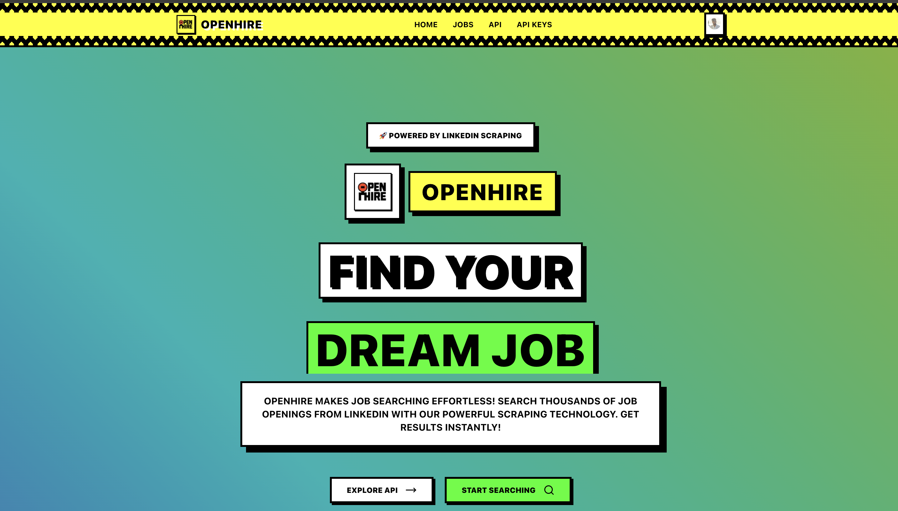

# OpenHire - Job Search Platform



**Live Site**: [https://openhire.vercel.app](https://openhire.vercel.app)

A beautiful, modern job search platform that scrapes LinkedIn job postings and provides both a web interface and REST API for job searching.

## Features

- 🔍 **Real-time Job Scraping**: Search thousands of job postings from LinkedIn
- 🌍 **Location-based Search**: Filter jobs by specific cities across India
- 🎨 **Beautiful UI**: Modern, responsive design with animated hero section and branded logo
- 🔐 **Secure Authentication**: User authentication with Clerk and API key management
- 🔑 **API Key Security**: Each user gets unique API keys for secure API access
- 📱 **Responsive Design**: Works perfectly on desktop and mobile
- 🚀 **REST API**: Programmatic access to job search functionality with authentication
- 📚 **API Documentation**: Comprehensive documentation with code examples

## Security Features

### API Key Authentication
- **Secure Access**: All API endpoints require valid API keys
- **User-Specific Keys**: Each user can create and manage multiple API keys
- **Usage Tracking**: Monitor API usage per key with detailed analytics
- **Key Management**: Create, view, and deactivate API keys as needed
- **Automatic Key Creation**: New users automatically get a default API key

### Protected Endpoints
- **Public API**: `/api/search-jobs` - Requires API key authentication
- **Internal API**: `/api/internal/search-jobs` - Used by website, requires user login
- **Key Management**: `/api/api-keys` - Manage user API keys (authenticated users only)

### Database Security
- **Supabase Integration**: Secure database with row-level security
- **Encrypted Storage**: API keys are securely stored and managed
- **Usage Analytics**: Track API calls, dates, and usage patterns

## Available Locations

- Bengaluru
- New Delhi
- Chennai
- Pune
- Hyderabad
- Mumbai
- Gurugram

## Tech Stack

- **Frontend**: Next.js 14, React, TypeScript
- **Styling**: Tailwind CSS, shadcn/ui components
- **Authentication**: Clerk
- **Database**: Supabase (PostgreSQL)
- **API Security**: Custom API key system
- **Animations**: Framer Motion
- **Icons**: Lucide React
- **Scraping**: Axios, Cheerio
- **API**: Next.js API Routes
- **Webhooks**: Svix for Clerk webhook verification
- **Deployment**: Vercel

## Getting Started

### Prerequisites

- Node.js 18+ 
- npm or yarn
- Clerk account (for authentication)
- Supabase project (for database)

### Installation

1. **Clone the repository**
   ```bash
   git clone <repository-url>
   cd openhire
   ```

2. **Install dependencies**
   ```bash
   npm install
   ```

3. **Set up environment variables**
   ```bash
   cp .env.local.example .env.local
   ```
   
   Edit `.env.local` and add your keys:
   ```env
   # Clerk Configuration
   NEXT_PUBLIC_CLERK_PUBLISHABLE_KEY=your_clerk_publishable_key_here
   CLERK_SECRET_KEY=your_clerk_secret_key_here
   CLERK_WEBHOOK_SECRET=your_clerk_webhook_secret_here
   
   # Supabase Configuration
   NEXT_PUBLIC_SUPABASE_URL=your_supabase_url_here
   NEXT_PUBLIC_SUPABASE_ANON_KEY=your_supabase_anon_key_here
   ```

4. **Run the development server**
   ```bash
   npm run dev
   ```

5. **Open your browser**
   Navigate to [http://localhost:3000](http://localhost:3000)

## Setting up Authentication & Database

### Clerk Setup
1. Go to [Clerk.com](https://clerk.com) and create an account
2. Create a new application
3. Copy the publishable key and secret key
4. Set up webhooks for user creation (optional, for automatic API key generation)

### Supabase Setup
1. Go to [Supabase.com](https://supabase.com) and create a project
2. Copy the project URL and anon key
3. The database schema will be automatically created when you first run the app

## API Usage

### Base URL
```
https://openhire.vercel.app/api
```

### Authentication
All API requests require authentication using API keys. You can get your API key by:

1. Signing up/in to your account at [https://openhire.vercel.app](https://openhire.vercel.app)
2. Going to the API Keys page
3. Creating a new API key
4. Using the key in your requests

### API Endpoints

#### Search Jobs (Public API)
**Endpoint**: `POST /api/search-jobs`

**Headers**:
```
Content-Type: application/json
x-api-key: your_api_key_here
```

**Request Body**:
```json
{
  "keywords": "Software Developer",
  "location": "Bengaluru",
  "numJobs": 25
}
```

**Response**:
```json
{
  "success": true,
  "jobs": [
    {
      "title": "Software Developer",
      "company": "Tech Company",
      "location": "Bengaluru, Karnataka, India",
      "postedDate": "2 days ago",
      "url": "https://linkedin.com/jobs/...",
      "status": "Actively recruiting"
    }
  ],
  "searchParams": {
    "keywords": "Software Developer",
    "location": "Bengaluru",
    "numJobs": 25
  },
  "totalFound": 25,
  "user": {
    "email": "user@example.com"
  }
}
```

#### API Key Management
- `GET /api/api-keys` - List user's API keys
- `POST /api/api-keys` - Create new API key
- `DELETE /api/api-keys?id=<key_id>` - Deactivate API key

### Get API Information

**Endpoint**: `GET /api/search-jobs`

Returns API information and available locations.

## Project Structure

```
openhire/
├── public/
│   ├── openhire.png              # Logo file
│   └── favicon.ico               # Favicon
├── src/
│   ├── app/
│   │   ├── api/
│   │   │   ├── search-jobs/      # Public API (requires API key)
│   │   │   ├── internal/
│   │   │   │   └── search-jobs/  # Internal API (requires login)
│   │   │   ├── api-keys/         # API key management
│   │   │   └── webhooks/
│   │   │       └── clerk/        # Clerk webhooks
│   │   ├── api-docs/             # API documentation
│   │   ├── api-keys/             # API key management page
│   │   ├── globals.css
│   │   ├── layout.tsx            # Main layout with logo
│   │   └── page.tsx              # Homepage with hero
│   ├── components/
│   │   └── ui/
│   │       ├── animated-hero.tsx # Hero section with logo
│   │       └── button.tsx
│   ├── lib/
│   │   ├── job-scraper.ts        # Job scraping logic
│   │   ├── supabase.ts           # Supabase client
│   │   ├── api-keys.ts           # API key management
│   │   └── utils.ts
│   └── middleware.ts             # Route protection
├── .env.local
├── package.json
└── README.md
```

## Branding & Design

### Logo Usage
- The OpenHire logo (`openhire.png`) is consistently used across all pages
- Logo appears in the header navigation, hero section, and page headers
- Favicon is automatically generated from the logo
- Logo maintains the neo-brutalist design aesthetic with borders and shadows

### Design System
- **Neo-brutalist Design**: Bold borders, shadows, and geometric shapes
- **Color Scheme**: Primary colors with high contrast
- **Typography**: Bold, uppercase text with wide tracking
- **Animations**: Smooth transitions and hover effects
- **Responsive**: Mobile-first design approach

## Security Best Practices

### API Key Security
- **Never expose API keys**: Don't commit API keys to version control
- **Use environment variables**: Store API keys securely in environment variables
- **Rotate keys regularly**: Deactivate and create new API keys periodically
- **Monitor usage**: Check your API usage regularly for any suspicious activity

### Website Security
- **Internal API**: The website uses an internal API that doesn't expose API keys in the browser
- **User Authentication**: All sensitive operations require user authentication
- **Protected Routes**: API key management pages are protected by authentication middleware

## Components

### Hero Section
- Animated text with rotating job-related terms
- Prominent OpenHire logo with animation
- Call-to-action buttons for API docs and job search
- Powered by Framer Motion animations

### Job Search Form
- Keyword input with search icon
- Location dropdown with available cities
- Number of jobs input with validation
- Real-time search with loading states

### Job Results
- Clean card layout for each job
- Company, location, and posting date
- Direct links to LinkedIn job postings

### API Key Management
- Create and manage multiple API keys
- View usage statistics and last used dates
- Secure key generation and storage
- Copy-to-clipboard functionality

## Rate Limiting

To ensure fair usage and maintain service quality:
- Maximum 100 jobs per request
- 2-second delay between pagination requests
- Recommended: 1 request per 5 seconds
- API usage is tracked per API key

## Contributing

1. Fork the repository
2. Create a feature branch
3. Make your changes
4. Add tests if applicable
5. Submit a pull request

## License

This project is licensed under the MIT License - see the LICENSE file for details.

## Support

For support, email support@openhire.com or create an issue in the GitHub repository.

## Deployment

### Vercel (Recommended)

1. Push your code to GitHub
2. Connect your repository to Vercel
3. Add environment variables in Vercel dashboard
4. Deploy

The application is currently deployed at: **[https://openhire.vercel.app](https://openhire.vercel.app)**

### Other Platforms

The application can be deployed on any platform that supports Next.js:
- Netlify
- Railway
- DigitalOcean App Platform
- AWS Amplify

Make sure to set the environment variables in your deployment platform.

## Environment Variables

| Variable | Description | Required |
|----------|-------------|----------|
| `NEXT_PUBLIC_CLERK_PUBLISHABLE_KEY` | Clerk publishable key | Yes |
| `CLERK_SECRET_KEY` | Clerk secret key | Yes |
| `NEXT_PUBLIC_CLERK_SIGN_IN_URL` | Sign in URL | No |
| `NEXT_PUBLIC_CLERK_SIGN_UP_URL` | Sign up URL | No |
| `NEXT_PUBLIC_CLERK_AFTER_SIGN_IN_URL` | Redirect after sign in | No |
| `NEXT_PUBLIC_CLERK_AFTER_SIGN_UP_URL` | Redirect after sign up | No |
| `NEXT_PUBLIC_APP_URL` | Application URL | No |
| `NEXT_PUBLIC_SUPABASE_URL` | Supabase project URL | Yes |
| `NEXT_PUBLIC_SUPABASE_ANON_KEY` | Supabase anonymous key | Yes |
